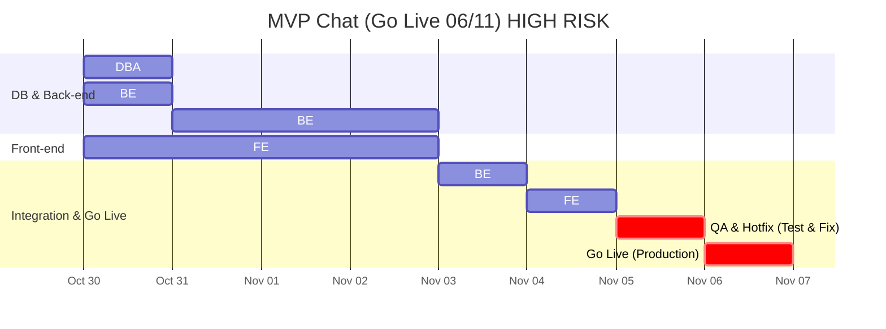

# Product Decision Records (PDRs)

Each PDR records a product decision. It is composed of the following sections and should give engineers a clear, actionable understanding of what needs to be built.

## Standard PDR Structure

- Status: Accepted

- Date: 2025-10-30

- Owners: Tech Team

- Links: Nenhum

- Context: Background, problem, constraints, decision drivers, evidence (link to metrics)

- Decision: The choice made, specific and testable

- Alternatives Considered: Options with pros/cons

- Consequences: Positive/negative impacts, risks, rollback plan

- Implementation Plan: High-level steps

- Testing and Verification: How we validate and monitor

- Traceability: RFs and RNFs affected; matrix link

- Effort Estimate: Ranges/assumptions by role

## Decision (Path Foward)

Este PDR documenta a decisão de implementar a feature "MVP Chat" — uma solução híbrida que combina:

- Um Chat de Geração de Projeto alimentado por IA (MVP) que ajuda o usuário a sair da "página em branco" e gera automaticamente uma estrutura inicial de Projeto + Listas de Tarefas + Tarefas.
- Um CRUD manual completo para Projetos, Listas de Tarefas (TaskLists) e Tarefas (Tasks) que garante controle total do usuário sobre o que a IA gerar ou o que for criado manualmente.

Esta decisão é específica e testável: até o Go Live em 2025-11-06 a entrega incluirá endpoints e UIs mínimos listados na seção "How" e os artefatos de banco de dados (migrations) necessários; sucesso será verificado por testes automatizados e cenários manuais descritos em "Test Cases".

## Why (Evidence and Support)

- Background problem: estamos enfrentando churn significativo. Dashboards do Grafana mostram queda nas requisições de usuários associadas a feedback que a estrutura de dados é rígida: os usuários não conseguem agrupar listas de tarefas dentro de um projeto (ex.: "Viagem à Europa" contendo listas por país).
- Decision drivers: métricas de uso (Grafana) e feedbacks apontam a limitação da arquitetura como causa principal de rejeição do produto. Prioridade estratégica: corrigir arquitetura central e diferenciar com IA.

## When (Support)

- Esta decisão foi tomada em 2025-10-30 durante uma sessão de planejamento de emergência.
- Prazo de Go Live fixo e inegociável: 2025-11-06. O cronograma é de ALTO RISCO e todas as datas são críticas.

## How

Implementaremos a funcionalidade de MVP Chat seguindo os passos detalhados abaixo. Os engenheiros devem marcar esses passos após a conclusão.

Banco de Dados (DBA)

- [ ] Projetar e gerar os scripts de migration para `Projects`, `TaskLists`, `Tasks`.
- [ ] Projetar e gerar os scripts de migration para `Chats` e `ChatMessages`.
- [ ] Preparar scripts de rollback versionados para todas as migrations.

Back-end (Fastify)

- [ ] Estruturar os Casos de Uso (Segregação de Serviços):
  - [ ] `ProjectService` (CRUD de Projetos).
  - [ ] `TaskListService` (CRUD de Listas de Tarefas).
  - [ ] `TaskService` (CRUD de Tarefas).
  - [ ] `ChatService` (lógica de conversação, orquestração com IA).
- [ ] Implementação da Lógica de Chat:
  - [ ] Desenvolver endpoint `POST /chats/messages` (se não houver `chat_id`, criar novo `Chat`; salvar mensagem do usuário).
  - [ ] Desenvolver endpoint `GET /chats` (listar chats do usuário).
  - [ ] Desenvolver endpoint `GET /chats/:id/messages` (ler histórico de mensagens).
- [ ] Implementação da IA (com LangChain):
  - [ ] Integrar `langchain-js` e cliente para Azure AI.
  - [ ] `ChatService` deve:
    - [ ] Definir o "Prompt da Persona" (Agente).
    - [ ] Gerenciar o histórico da conversa (ChatMessageHistory).
    - [ ] Chamar a Azure AI e salvar a resposta na tabela `ChatMessages`.
    - [ ] Orquestrar chamada ao `ProjectService` se a IA decidir que um `Project` deve ser gerado.
- [ ] Implementar endpoints CRUD de `Projects` e rotas auxiliares `/projects/:id/lists` etc., necessários para o frontend exibir resultados.

Front-end (Next.js)

- [ ] UI de Chat (Entrada):
  - [ ] Criar UI de "Histórico de Chats" (consumir `GET /chats`).
  - [ ] Criar UI de "Conversa" (chat em si) e integrar `GET /chats/:id/messages` e `POST /chats/messages`.
  - [ ] Atualizar a UI em tempo real com a resposta da IA (streaming ou polling conforme viável).
- [ ] UI de Projetos (Saída - Resultado):
  - [ ] Criar página "Meus Projetos" (listar `Projects` gerados pela IA ou manualmente).
  - [ ] Criar página "Detalhe do Projeto" (listar `TaskLists` de `GET /projects/:id/lists`).
  - [ ] Garantir que a UI de `Tasks` funcione corretamente dentro de `TaskLists`.
  - [ ] Implementar CRUD manual (Criar/Editar/Deletar) para `Projects`, `TaskLists` e `Tasks`.

## Test Cases

Testaremos a funcionalidade do AI Chat conforme os passos abaixo (automáticos quando possível).

- [ ] DBA: Verificar que todas as migrations (`Projects`, `TaskLists`, `Tasks`, `Chats`, `ChatMessages`) são aplicadas corretamente.
- [ ] DBA: Verificar que todos os scripts de rollback funcionam e revertam o esquema corretamente.
- [ ] API: Testar `POST /chats/messages` sem `chat_id` — deve criar novo `Chat` e salvar a mensagem do usuário.
- [ ] API: Testar `POST /chats/messages` com `chat_id` existente — deve adicionar mensagem ao chat correto.
- [ ] API: Testar `GET /chats` — retorna lista de chats do usuário.
- [ ] API: Testar `GET /chats/:id/messages` — retorna histórico completo do chat.
- [ ] API: Testar endpoints CRUD de `Projects` (POST/PUT/DELETE/GET).
- [ ] AI: Enviar prompt de teste (ex.: "planeje minha semana") e validar:
  - [ ] Azure AI é chamada.
  - [ ] Resposta da IA é salva em `ChatMessages`.
  - [ ] Um `Project` é criado com sucesso via `ProjectService` quando a IA decidir gerar projeto.
- [ ] AI: Enviar prompt não relacionado a projetos (ex.: "olá") e verificar que nenhum `Project` é criado.
- [ ] FE: Carregar UI "Histórico de Chats" e verificar renderização a partir de `GET /chats`.
- [ ] FE: Abrir um chat e verificar carregamento do histórico (`GET /chats/:id/messages`).
- [ ] FE: Enviar mensagem da UI — `POST /chats/messages` é chamado e a resposta da IA aparece na UI.
- [ ] FE: Após IA gerar um projeto, navegar em "Meus Projetos" e verificar listagem do novo `Project`.
- [ ] FE: Verificar CRUD manual para criação/edição/deleção de `Projects`, `TaskLists` e `Tasks` na UI.

## Traceability matrix (US - Product Motive)

Esta matriz vincula as user stories da funcionalidade aos principais motivadores de negócio.

| User Story ID | User Story Description | Product Motive ID | Product Motive Description |
|---------------|------------------------|-------------------|----------------------------|
| US-101 | Como usuário, quero descrever minha ideia em linguagem natural (chat) para que a IA gere automaticamente uma estrutura de projeto e tarefas. | PM-01 | Endereçar o churn resolvendo o problema da "página em branco" e fornecendo flexibilidade de projeto |
| US-102 | Como usuário, quero visualizar e gerenciar (criar/editar/deletar) os projetos gerados pela IA ou manualmente. | PM-02 | Aumentar ativação e diferenciação (IA) mantendo controle total (CRUD) |
| US-103 | Como usuário, quero ver meu histórico de chats para continuar ou revisar conversas. | PM-03 | Melhorar usabilidade e continuidade da experiência (conversas assíncronas) |
| US-104 | Como usuário, quero abrir um projeto e ver as TaskLists dentro dele. | PM-01 | Endereçar o churn fornecendo a flexibilidade necessária |
| US-105 | Como usuário, quero gerenciar (criar/editar/deletar) Tasks dentro de uma TaskList. | PM-02 | Garantir controle total e manter diferenciação |
| US-106 | Como usuário, quero ver a resposta da IA em tempo real ao enviar uma mensagem. | PM-03 | Melhorar continuidade e experiência em tempo real |
| US-107 | Como usuário, quero que a IA entenda o contexto da conversa e gere projetos relevantes com base no histórico. | PM-02 | Aumentar ativação e relevância das gerações de IA |

## Consequences

- Positive Impacts:
  - Endereça diretamente o principal motivo de churn (flexibilidade da arquitetura).
  - Fornece diferencial competitivo com IA ("fator uau").
  - Garante controle do usuário via CRUD manual.

- Risks:
  - ALTO RISCO: prazo de 2025-11-06 é extremamente agressivo para implementar IA (LangChain + Azure AI) e CRUD completo simultaneamente.

- Mitigation:
  - Equipe composta por engenheiros seniores revisou o plano e comprometeu horas extras para cumprir o prazo.
  - Priorizar entregas mínimas viáveis para reduzir blast radius; fazer deploy por feature-flag e rollout controlado.

- Rollback Plan:
  - DBA executará scripts de rollback versionados para reverter migrations (Projects, TaskLists, Tasks, Chats, ChatMessages).
  - Reimplantar artefatos estáveis anteriores (imagens de contêiner do backend e frontend) em produção simultaneamente.

## Effort Estimate / How Much

Este cronograma é de ALTO RISCO e inegociável. Todas as datas são críticas. O Gantt abaixo reflete o plano tempo-critico até Go Live em 2025-11-06.

# Product Decision Records (PDRs)

Each PDR records a product decision. It is composed of the following sections and should give engineers a clear, actionable understanding of what needs to be built.

## Standard PDR Structure

- Status: Accepted

- Date: 2025-10-30

- Owners: Tech Team

- Links: None

- Context: Background, problem, constraints, decision drivers, evidence (link to metrics)

- Decision: The choice made, specific and testable

- Alternatives Considered: Options with pros/cons

- Consequences: Positive/negative impacts, risks, rollback plan

- Implementation Plan: High-level steps

- Testing and Verification: How we validate and monitor

- Traceability: RFs and RNFs affected; matrix link

- Effort Estimate: Ranges/assumptions by role

## Decision (Path Forward)

This PDR documents the decision to implement the "MVP Chat" feature — a hybrid solution that combines:

- An AI-powered Project Generation Chat (MVP) that helps users overcome the "blank page" problem and automatically generates an initial structure: Project + TaskLists + Tasks.
- A full manual CRUD for Projects, TaskLists and Tasks to ensure users retain full control over AI-generated or user-created content.

This decision is specific and testable: by the Go Live date (2025-11-06) the delivery will include the minimal endpoints and UIs listed in the "How" section and the required database artifacts (migrations). Success will be verified by automated tests and manual scenarios described in "Test Cases".

## Why (Evidence and Support)

- Background problem: the product is experiencing significant churn. Grafana dashboards show a drop in user requests correlated with user feedback that the data model is too rigid: users cannot group task lists under a shared project (e.g., "Trip to Europe" with lists for each country).
- Decision drivers: usage metrics (Grafana) and user feedback indicate the current architecture limitation is a primary cause of rejection. Strategic priority: fix the core architecture and differentiate the product with AI.

## When (Support)

- The decision was made on 2025-10-30 during an emergency planning session.
- Fixed, non-negotiable Go Live date: 2025-11-06. The schedule is HIGH RISK and all dates are critical.

## How

We will implement the MVP Chat feature following the steps below. Engineers should mark these items as complete when done.

Database (DBA)

- [ ] Design and generate migration scripts for `Projects`, `TaskLists`, `Tasks`.
- [ ] Design and generate migration scripts for `Chats` and `ChatMessages`.
- [ ] Prepare versioned rollback scripts for all migrations.

Back-end (Fastify)

- [ ] Structure Use Cases (Service segregation):
  - [ ] `ProjectService` (manage Projects CRUD).
  - [ ] `TaskListService` (manage TaskLists CRUD).
  - [ ] `TaskService` (manage Tasks CRUD).
  - [ ] `ChatService` (manage conversation logic and AI orchestration).
- [ ] Implement chat logic:
  - [ ] Create endpoint `POST /chats/messages` (if no `chat_id` provided, create a new Chat; persist the user message).
  - [ ] Create endpoint `GET /chats` (list user's chats).
  - [ ] Create endpoint `GET /chats/:id/messages` (read chat message history).
- [ ] AI integration (LangChain):
  - [ ] Integrate `langchain-js` and an Azure AI client.
  - [ ] `ChatService` must:
    - [ ] Define the Persona Prompt (Agent).
    - [ ] Manage the conversation history (ChatMessageHistory).
    - [ ] Call Azure AI and persist the AI response in `ChatMessages`.
    - [ ] Orchestrate a call to `ProjectService` if the AI decides a `Project` should be generated.
- [ ] Implement Projects CRUD endpoints and helper routes (`/projects/:id/lists`, etc.) required by the frontend.

Front-end (Next.js)

- [ ] Chat UI (Input):
  - [ ] Create a "Chat History" view that consumes `GET /chats`.
  - [ ] Create the Chat Conversation UI and integrate with `GET /chats/:id/messages` and `POST /chats/messages`.
  - [ ] Update the UI in real time with AI responses (streaming or polling as appropriate).
- [ ] Projects UI (Output/Result):
  - [ ] Implement "My Projects" page (list `Projects` generated by AI or created manually).
  - [ ] Implement "Project Details" page (show `TaskLists` via `GET /projects/:id/lists`).
  - [ ] Ensure the existing (or new) `Tasks` UI works correctly within `TaskLists`.
  - [ ] Implement manual CRUD controls (Create/Edit/Delete) for `Projects`, `TaskLists`, and `Tasks`.

## Test Cases

We will validate the AI Chat functionality using the steps below (automate where possible).

- [ ] DBA: Verify migrations (`Projects`, `TaskLists`, `Tasks`, `Chats`, `ChatMessages`) apply correctly.
- [ ] DBA: Verify rollback scripts run and revert schema changes correctly.
- [ ] API: Test `POST /chats/messages` without `chat_id` — must create a new Chat and persist the user's message.
- [ ] API: Test `POST /chats/messages` with an existing `chat_id` — must append the message to the correct chat.
- [ ] API: Test `GET /chats` — returns the user's list of chats.
- [ ] API: Test `GET /chats/:id/messages` — returns full history for that chat.
- [ ] API: Test Projects CRUD endpoints (POST/PUT/DELETE/GET).
- [ ] AI: Send a sample prompt (e.g., "plan my week") and validate:
  - [ ] Azure AI is called.
  - [ ] AI response is saved to `ChatMessages`.
  - [ ] A `Project` is successfully created via `ProjectService` when AI decides to generate one.
- [ ] AI: Send a non-project prompt (e.g., "hello") and verify no `Project` is created.
- [ ] FE: Load "Chat History" UI and confirm it renders data from `GET /chats`.
- [ ] FE: Open a chat and confirm history loads via `GET /chats/:id/messages`.
- [ ] FE: Send a message from the UI — `POST /chats/messages` is invoked and AI response appears in the UI.
- [ ] FE: After AI generates a project, navigate to "My Projects" and confirm the new `Project` is listed.
- [ ] FE: Verify manual CRUD for creating/editing/deleting `Projects`, `TaskLists`, and `Tasks` in the UI.

## Traceability matrix (US - Product Motive)

This matrix links user stories for this feature to the primary business motives.

| User Story ID | User Story Description | Product Motive ID | Product Motive Description |
|---------------|------------------------|-------------------|----------------------------|
| US-101 | As a user, I want to describe my idea in natural language (chat) so the AI can auto-generate a project and tasks. | PM-01 | Address churn by solving the "blank page" problem and providing project flexibility |
| US-102 | As a user, I want to view and manage (create/edit/delete) projects generated by AI or manually. | PM-02 | Increase activation and differentiation (AI) while preserving full control (CRUD) |
| US-103 | As a user, I want to see my previous chat history to continue or review conversations. | PM-03 | Improve usability and continuity (asynchronous conversations) |
| US-104 | As a user, I want to open a project and see the TaskLists inside it. | PM-01 | Address churn by providing the required flexibility |
| US-105 | As a user, I want to manage (create/edit/delete) tasks within a TaskList. | PM-02 | Ensure full control and retain differentiation |
| US-106 | As a user, I want to see the AI's response in real time when I send a message. | PM-03 | Improve continuity and real-time UX |
| US-107 | As a user, I want the AI to understand conversation context and generate relevant projects based on history. | PM-02 | Increase activation and relevance of AI-generated content |

## Consequences

- Positive Impacts:
  - Directly addresses the primary churn driver (data model flexibility).
  - Provides a competitive AI-driven differentiator ("wow factor").
  - Ensures user control via manual CRUD.

- Risks:
  - HIGH RISK: the 2025-11-06 deadline is extremely aggressive for implementing both AI (LangChain + Azure AI) and a full CRUD surface in parallel.

- Mitigation:
  - Senior engineers have reviewed the plan and committed to overtime to meet the deadline.
  - Prioritize minimal viable deliveries to reduce blast radius; deploy behind feature flags and roll out gradually.

- Rollback Plan:
  - DBA will run versioned rollback scripts to revert migrations (`Projects`, `TaskLists`, `Tasks`, `Chats`, `ChatMessages`).
  - Re-deploy previous stable artifacts (backend and frontend container images) to production concurrently.

## Effort Estimate / How Much

This schedule is HIGH RISK and non-negotiable. All dates are critical. The Gantt below reflects the time-critical plan to Go Live on 2025-11-06.

---

Explicit notes and assumptions:

- Azure AI integration requires credentials configured in CI/CD and a privacy review (do not send PII without consent).
- LangChain will be used as an orchestration/prompt-layer; Azure AI cost and latency should be monitored.
- If the schedule becomes infeasible, prioritize core CRUD to fix the architecture and enable Chat AI behind a feature flag later.

If you want, I can:

- Extract this PDR into a checklist of issues/PRs (granular tasks).
- Generate example SQL migration skeletons for `Projects`, `TaskLists`, `Tasks`, `Chats`, `ChatMessages`.
- Create a PR adding this PDR to the repository and generate issues for each checklist item.

Tell me which of the options you'd like me to execute next.
