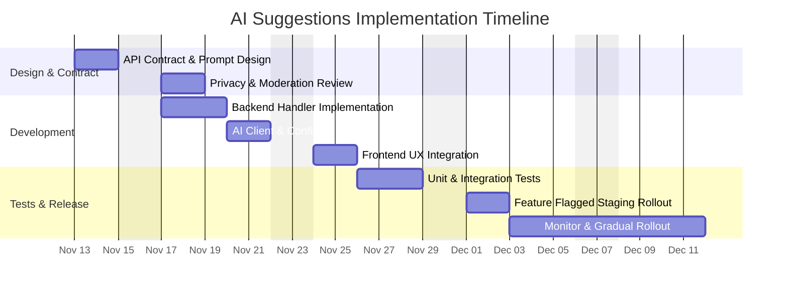

# Product Decision Records (PDRs)

Each PDR records a product decision. It is composed of the following sections and should give engineers a clear, actionable understanding of what needs to be built.


## Standard PDR Structure

- Status: Proposed

 - Date: 2025-11-11

 - Owners:
    - Gabriel Storti — Product Owner — gabriel.storti@example.com
    - Backend Lead — backend.lead@example.com (TBD)
    - ML/AI Engineer — ml.engineer@example.com (TBD)
    - Frontend Engineer — luis.chiqueto@example.com

 - Links:
    - Issue / Ticket (AI suggestions): https://github.com/memento-marcio-org/Planeja-AI/issues/43
    - PR (AI implementation): https://github.com/memento-marcio-org/Planeja-AI/pull/43
    - Frontend call: `frontend/planeja-ai/app/page.tsx` (calls `/api/suggest-task`)
    - Suggested API: `/api/suggest-task` (verify implementation)
    - Related files: `frontend/planeja-ai/components/add-task-form.tsx`, `backend/src/routes`, `backend/src/controllers`
    - Docs (AI policy placeholder): docs/AI_Security.md

- Context: Background, problem, constraints, decision drivers, evidence (link to metrics)

- Decision: The choice made, specific and testable

- Alternatives Considered: Options with pros/cons

- Consequences: Positive/negative impacts, risks, rollback plan

- Implementation Plan: High-level steps

- Testing and Verification: How we validate and monitor

- Traceability: RFs and RNFs affected; matrix link

- Effort Estimate: Ranges/assumptions by role


## Decision (Path Foward)

We will formalize, implement (if missing), and harden an AI-based task suggestion feature reachable at `/api/suggest-task`. This decision covers: defining the API contract, implementing server-side logic (AI prompt, rate limiting, safe-guards), connecting to whichever AI provider or local model is chosen, adding UI/UX flow in `AddTaskForm`, and end-to-end tests and monitoring.

Justification:

```text
The frontend already references an AI suggestion flow (`/api/suggest-task`). To avoid fragile, undocumented behavior and to ensure consistent user experience, we will standardize the endpoint, add validation, implement rate limits and safe content filtering, and provide tests and observability. This reduces user-facing errors and increases trust in the AI suggestions.
```


## Why (Evidence and Support)

- Frontend evidence: `AddTaskForm` includes a "Sugerir com IA" button that calls `handleAISuggest`, which POSTs to `/api/suggest-task` and expects `{ suggestion }` in the response.
- Product motive: Reduce friction for users to capture tasks and improve engagement by assisting with task creation.
- Constraints: Must respect privacy (no sensitive data exfiltration), be rate-limited to avoid abuse, and follow API latency targets (p95 < 1s ideally), or degrade gracefully.


## When (Support)

Decision made: 2025-11-11. Implement in next sprint after baseline stabilization of core To-Do flows. Priority: Medium — user-facing but optional; can be behind a feature flag for controlled rollout.


## How

Implementation steps and checklist:

1. Discovery & Contract
   - [ ] Confirm whether `/api/suggest-task` exists; if not, create route under frontend `app/api` (Next.js) or backend routes.
   - [ ] Define API contract: POST /api/suggest-task -> { suggestion: string } (200) | { error } (4xx/5xx).

2. Backend implementation
   - [ ] Implement handler that receives minimal context (optional user prompt, optional list of recent tasks), constructs a safe prompt for AI provider.
   - [ ] Add input validation and sanitization.
   - [ ] Add rate limiting per-user/IP (use existing rate limit config in `backend/src/config/index.ts`).
   - [ ] Add content moderation filtering (deny responses containing PII or unsafe content).

3. AI integration
   - [ ] Choose provider (OpenAI/Anthropic/local LLM). Document configuration in env vars (AI_PROVIDER_URL, AI_API_KEY).
   - [ ] Implement client wrapper with retries and timeout (e.g., 5s timeout).

4. Frontend wiring
   - [ ] Ensure `AddTaskForm` triggers the endpoint and handles errors with user-facing messages.
   - [ ] Add loading state and disable multiple clicks.

5. Tests & Monitoring
   - [ ] Unit tests for handler logic (mock AI responses and moderation).
   - [ ] Integration tests for end-to-end flow (UI -> API -> create task).
   - [ ] Add metrics: suggestions requested, suggestions accepted (user added), suggestion error rate, AI latency.

6. Rollout
   - [ ] Deploy behind feature flag, enable for small user cohort, monitor metrics, then full rollout.

Checklist (engineers):

- [ ] Implement API contract and handler.
- [ ] Add unit and integration tests.
- [ ] Add observability (error logging, metrics).
- [ ] Configure provider keys in secure env (not checked into repo).
- [ ] Perform privacy review and ensure no PII is sent to provider.


## Test Cases

- [ ] Verify POST /api/suggest-task returns a valid suggestion in expected schema for authenticated and unauthenticated users (if supported).
- [ ] Verify rate limiting: multiple rapid requests from same user/IP are throttled.
- [ ] Verify content filtering: suggestions containing PII or prohibited content are rejected and logged.
- [ ] Verify UI: clicking "Sugerir com IA" shows loading, and successful suggestion populates AddTask input and can be added.
- [ ] Verify fallback: if AI provider is down or times out, UI shows a friendly error and does not block manual task entry.
- [ ] Security: AI API keys and responses not logged in plaintext.


## Traceability matrix (US - Product Motive)

| User Story ID | User Story Description | Product Motive ID | Product Motive Description |
|---------------|------------------------|-------------------|----------------------------|
| US-AI-01 | As a user, I want AI suggestions to quickly add tasks | PM-AI-01 | Increase speed of task capture and reduce entry friction |
| US-AI-02 | As a user, I want suggestions to be safe and relevant | PM-AI-02 | Maintain trust and reduce harmful content |


## How Much

Recommended timeline for a small team:




Notes & assumptions:
- AI provider and cost estimates not included; obtain approval before production usage.
- Privacy review mandatory before sending user data to third-party AI.
- If the endpoint already exists, this PDR formalizes and hardens it rather than re-implementing.

