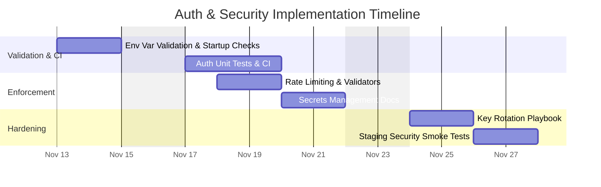

# Product Decision Records (PDRs)

Each PDR records a product decision. It is composed of the following sections and should give engineers a clear, actionable understanding of what needs to be built.


## Standard PDR Structure

- Status: Proposed

 - Date: 2025-11-11

 - Owners:
    - Backend Lead — backend.lead@example.com
    - Security Owner — security.owner@example.com
    - DevOps (Secrets) — gabriel.davi@example.com

 - Links:
    - Issue / Ticket (Auth hardening): https://github.com/memento-marcio-org/Planeja-AI/issues/44
    - PR (Auth & Security): https://github.com/memento-marcio-org/Planeja-AI/pull/44
    - Auth middleware: `backend/src/middleware/auth.ts`
    - Config: `backend/src/config/index.ts`
    - Supabase config: `backend/src/config/supabase.ts`
    - CI docs (secrets): docs/CI_Secrets.md

- Context: Background, problem, constraints, decision drivers, evidence (link to metrics)

- Decision: The choice made, specific and testable

- Alternatives Considered: Options with pros/cons

- Consequences: Positive/negative impacts, risks, rollback plan

- Implementation Plan: High-level steps

- Testing and Verification: How we validate and monitor

- Traceability: RFs and RNFs affected; matrix link

- Effort Estimate: Ranges/assumptions by role


## Decision (Path Foward)

We will formalize authentication and security practices across the backend API: enforce JWT verification on all protected routes, validate environment secrets on startup, rotate service keys, add rate limiting, input validation, and secrets management guidance. We will create tests and CI checks to validate authentication flows and token handling.

Justification:

```text
The current code includes an `authenticateToken` middleware and uses environment configuration, but we must ensure consistent enforcement and automated tests to prevent regressions and security misconfigurations in containerized environments.
```


## Why (Evidence and Support)

- Evidence: Routes under `backend/src/routes/tasks.ts` apply `authenticateToken()` (router.use). `server.ts` configures JSON limits and logging. `config/index.ts` includes rateLimit and security config.
- Drivers: Protect user data (Supabase records), comply with best practices for auth and secrets, reduce risk of token leakage, and ensure proper rate-limiting to mitigate abuse.


## When (Support)

Decision date: 2025-11-11. Prioritize immediately for any production or public preview deployments. Implement initial checks in the next sprint.


## How

Implementation checklist:

1. Secrets & Startup validation
   - [ ] Fail fast if required env vars (SESSION_SECRET, SUPABASE_* keys, AI keys) are missing.
   - [ ] Add a startup health check that validates DB connectivity and auth config.

2. Authentication enforcement
   - [ ] Ensure `authenticateToken` is applied to all API v1 routes by default (verify router hierarchy).
   - [ ] Implement unit tests for token verification middleware (valid token, expired token, malformed token).

3. Rate limiting & input validation
   - [ ] Configure `express-rate-limit` with values from `config.rateLimit` and add tests for behavior.
   - [ ] Ensure `express-validator` validators are applied to all endpoints that accept user input, and add tests for invalid payloads.

4. Secrets management
   - [ ] Add documentation for storing secrets in CI/CD (GitHub Actions Secrets, Vault, or secret manager).
   - [ ] Ensure no secrets are logged; mask sensitive logs.

5. CI & Tests
   - [ ] Add CI step that runs security linting (e.g., eslint security rules) and a basic auth unit/integration test suite.

6. Incident & Rollback
   - [ ] Prepare script to rotate keys and invalidate sessions if a key is compromised.


## Test Cases

- [ ] Valid JWT allows access to protected endpoints and returns 200.
- [ ] Expired or invalid JWT returns 401 with consistent error body.
- [ ] Missing required env vars causes startup failure in CI/test environments.
- [ ] Rate limiting blocks requests after threshold and returns 429.
- [ ] Input validation rejects malformed payloads with 400 and descriptive errors.
- [ ] Secrets not present in logs (scan CI logs to ensure no secret leakage).


## Traceability matrix (US - Product Motive)

| User Story ID | User Story Description | Product Motive ID | Product Motive Description |
|---------------|------------------------|-------------------|----------------------------|
| US-AUTH-01 | As a user, I want my tasks protected behind authentication | PM-Security-01 | Protect user data and privacy |
| US-AUTH-02 | As an operator, I want to detect misconfigurations early | PM-Security-02 | Reduce production incidents |


## How Much



Notes & assumptions:
- We're using JWT sessions currently; session secrets must be strong and rotated periodically.
- CI/CD integration for secrets is assumed available (GitHub Actions or similar).

