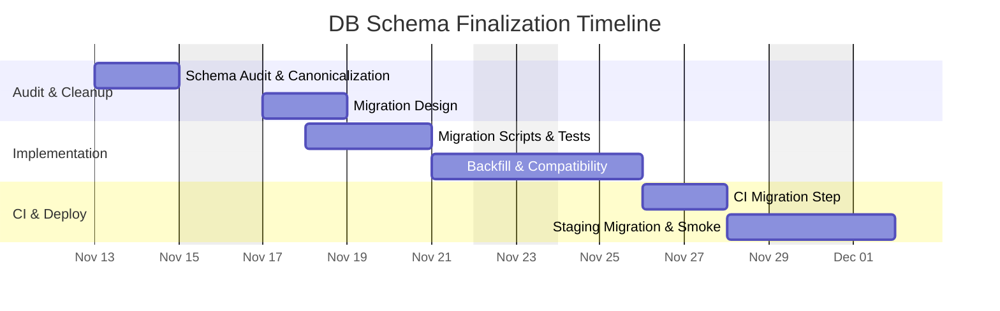

# Product Decision Records (PDRs)

Each PDR records a product decision. It is composed of the following sections and should give engineers a clear, actionable understanding of what needs to be built.


## Standard PDR Structure

- Status: Proposed

 - Date: 2025-11-11

 - Owners:
    - Backend Lead — backend.lead@example.com
    - DBA — dba@example.com (TBD)
    - DevOps — gabriel.davi@example.com
    - NoSQL Implementation — Leticia Cristina Silva (RA: 21352)

 - Links:
    - Issue / Ticket (DB migrations): https://github.com/memento-marcio-org/Planeja-AI/issues/45
    - PR (DB migrations): https://github.com/memento-marcio-org/Planeja-AI/pull/45
    - DB schema: `backend/database/schema.sql`
    - Supabase helpers: `backend/src/config/supabase.ts`
    - Migration folder (target): `backend/database/migrations/` (to be created)

- Context: Background, problem, constraints, decision drivers, evidence (link to metrics)

- Decision: The choice made, specific and testable

- Alternatives Considered: Options with pros/cons

- Consequences: Positive/negative impacts, risks, rollback plan

- Implementation Plan: High-level steps

- Testing and Verification: How we validate and monitor

- Traceability: RFs and RNFs affected; matrix link

- Effort Estimate: Ranges/assumptions by role


## Decision (Path Foward)

We will formalize the database schema for the To-Do application: confirm fields on `to_do_item` (add `priority`, `due_date`, `created_at`, `updated_at`), enforce constraints (FKs, unique indices), and create migration scripts (SQL or migration tool). We'll maintain backward compatibility for existing data and provide automated migration tests.

Justification:

```text
The schema file shows some duplicated/fragmented SQL sections and references to fields via indices (`priority`, `due_date`) suggesting intended fields; we must standardize and create a single, validated migration to avoid runtime issues when deploying and to ensure frontend/back-end alignment.
```


## Why (Evidence and Support)

- `backend/database/schema.sql` contains `to_do_item`, `to_do_list`, `to_do_plan`, and `steps` tables, but the file contains duplicated segments and some fields referenced in indices that are not consistently defined.
- Drivers: Data integrity, reliable queries (indices), easy migrations, and reduced production incidents.


## When (Support)

Decision date: 2025-11-11. Implement in the upcoming sprint prior to production deployment or whenever DB changes are required.


## How

Checklist:

1. Audit & Cleanup
   - [ ] Review `schema.sql` and remove duplicated sections; produce canonical schema file.
   - [ ] Confirm required fields: `priority` (enum or varchar), `due_date` (timestamp with timezone), `created_at`, `updated_at`.

2. Migrations
   - [ ] Create migration scripts (preferably using a migration tool like Flyway, Liquibase, or node-pg-migrate) and store them in `backend/database/migrations/`.
   - [ ] Add idempotent checks so migrations can be run safely in staging/production.

3. Constraints & Indexes
   - [ ] Ensure FK constraints exist and `ON DELETE CASCADE` is intentional where used.
   - [ ] Create indices for `list_id`, `done`, `priority`, `due_date` as in schema.

4. Backfill & Compatibility
   - [ ] For existing databases, create backfill scripts for new columns (set defaults where safe).
   - [ ] Add migration tests that run against ephemeral test DB.

5. Testing & CI
   - [ ] Add migration step to CI (apply migrations to test DB and run smoke tests).


## Test Cases

- [ ] Migration applies cleanly on a fresh DB.
- [ ] Migration applies on an existing DB with sample data and preserves expected records.
- [ ] FK constraints prevent orphaned items.
- [ ] Indices exist and queries using filters (`done`, `priority`, `due_date`) use indices (EXPLAIN in test environment).
- [ ] `created_at` and `updated_at` are correctly set and triggers update `updated_at` on row updates.


## Traceability matrix (US - Product Motive)

| User Story ID | User Story Description | Product Motive ID | Product Motive Description |
|---------------|------------------------|-------------------|----------------------------|
| US-DB-01 | Ensure tasks persist reliably with metadata | PM-DB-01 | Data integrity and query performance |
| US-DB-02 | Support filtering by priority and due date | PM-DB-02 | Improve task management and sorting |


## How Much



Notes & assumptions:
- Supabase is used as the DB host; ensure migration tool supports Supabase/Postgres.
- Existing production data may require manual backfill planning.

