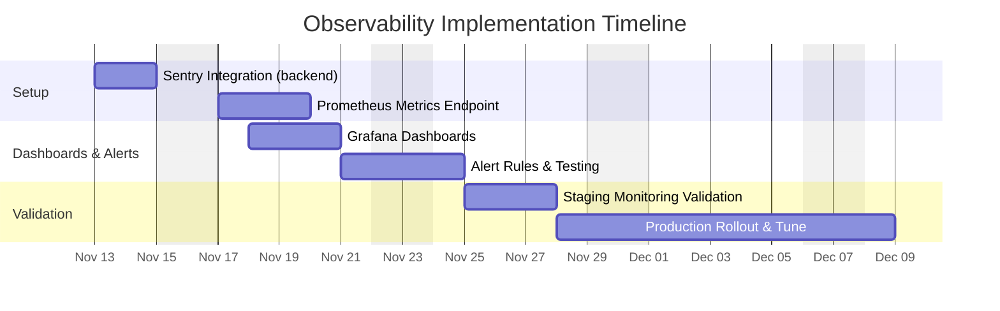

# Product Decision Records (PDRs)

Each PDR records a product decision. It is composed of the following sections and should give engineers a clear, actionable understanding of what needs to be built.


## Standard PDR Structure

- Status: Proposed

 - Date: 2025-11-11

 - Owners:
    - DevOps/Infra Lead — gabriel.davi@example.com
    - Backend Lead — backend.lead@example.com
    - Product Owner — gabriel.storti@example.com

 - Links:
    - Issue / Ticket (Observability setup): https://github.com/memento-marcio-org/Planeja-AI/issues/47
    - PR (Observability): https://github.com/memento-marcio-org/Planeja-AI/pull/47
    - Health endpoints: `backend/server.ts` and `backend/src/routes/index.ts` (health route)
    - Supabase helpers: `backend/src/config/supabase.ts`
    - Dashboard (placeholder): https://grafana.example.com/d/planeja/infra-dashboard

- Context: Background, problem, constraints, decision drivers, evidence (link to metrics)

- Decision: The choice made, specific and testable

- Alternatives Considered: Options with pros/cons

- Consequences: Positive/negative impacts, risks, rollback plan

- Implementation Plan: High-level steps

- Testing and Verification: How we validate and monitor

- Traceability: RFs and RNFs affected; matrix link

- Effort Estimate: Ranges/assumptions by role


## Decision (Path Foward)

Implement structured observability: add error tracking (Sentry), request/response metrics (Prometheus + Grafana or Supabase monitoring), and alerting for key health indicators (error rate, latency, DB connectivity). Ensure health endpoint reports uptime and environment and is used by monitoring/ingress.

Justification:

```text
The repository includes a health endpoint and logging middleware; formalizing observability will help detect issues early and give business metrics for product decisions. Adding Sentry and metrics will reduce mean time to detect and fix production incidents.
```


## Why (Evidence and Support)

- `server.ts` includes a health check and basic logging middleware. `supabase.ts` includes functions for testing connection and retrieving DB structure, which can be reused for health checks.
- Drivers: reduce downtime, monitor API latency and error rates, and provide dashboards for stakeholders.


## When (Support)

Decision date: 2025-11-11. Implement in parallel with stabilization and testing work; deploy to staging first.


## How

Checklist:

1. Error Tracking
   - [ ] Integrate Sentry in backend (capture unhandled exceptions) and frontend (capture frontend errors and sessions).
   - [ ] Configure sampling and PII scrubbing.

2. Metrics
   - [ ] Add Prometheus metrics endpoint (or use managed metrics) to track request counts, latencies (histograms), error rates, DB connection status.
   - [ ] Create Grafana dashboards for task-related KPIs and SLI/SLOs.

3. Alerts
   - [ ] Create alert rules: error rate spike (>1% of requests), high latency (p95 > 1s), DB disconnected.

4. Health checks & Readiness
   - [ ] Ensure `GET /health` includes DB connectivity and external service check (AI provider) status optionally.
   - [ ] Configure container orchestration to use `/health` for readiness/liveness.

5. Logging
   - [ ] Structured JSON logs with request IDs and masked PII; centralize logs in ELK/Cloud Logs.


## Test Cases

- [ ] Sentry receives a test exception from backend and is visible in dashboard.
- [ ] Prometheus scrapes metrics endpoint and Grafana shows request latency and error rate.
- [ ] Health endpoint returns `connected` when DB is reachable and `disconnected` when not.
- [ ] Alerts trigger on simulated error rate increases.


## Traceability matrix (US - Product Motive)

| User Story ID | User Story Description | Product Motive ID | Product Motive Description |
|---------------|------------------------|-------------------|----------------------------|
| US-OBS-01 | As an operator, I want alerts for high error rates | PM-OBS-01 | Reduce time to detect incidents |
| US-OBS-02 | As a product manager, I want dashboards for task KPIs | PM-OBS-02 | Measure feature adoption and health |


## How Much



Notes & assumptions:
- Requires infrastructure to host Prometheus/Grafana or a managed alternative.
- Sentry plan may incur cost; start with free tier for staging.

