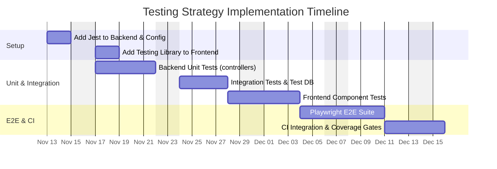

# Product Decision Records (PDRs)

Each PDR records a product decision. It is composed of the following sections and should give engineers a clear, actionable understanding of what needs to be built.


## Standard PDR Structure

- Status: Proposed

 - Date: 2025-11-11

 - Owners:
    - Engineering Manager — eng.manager@example.com (TBD)
    - QA Lead — qa.lead@example.com
    - Backend Lead — backend.lead@example.com
    - Frontend Lead — luis.chiqueto@example.com

 - Links:
    - Issue / Ticket (Testing plan): https://github.com/memento-marcio-org/Planeja-AI/issues/46
    - PR (Testing infra): https://github.com/memento-marcio-org/Planeja-AI/pull/46
    - Backend package.json: `backend/package.json`
    - Frontend package.json: `frontend/planeja-ai/package.json`
    - Testable code areas: `backend/src/controllers`, `frontend/planeja-ai/components`
    - CI config (to be updated): `.github/workflows/ci.yml`

- Context: Background, problem, constraints, decision drivers, evidence (link to metrics)

- Decision: The choice made, specific and testable

- Alternatives Considered: Options with pros/cons

- Consequences: Positive/negative impacts, risks, rollback plan

- Implementation Plan: High-level steps

- Testing and Verification: How we validate and monitor

- Traceability: RFs and RNFs affected; matrix link

- Effort Estimate: Ranges/assumptions by role


## Decision (Path Foward)

Adopt a pragmatic testing strategy: unit tests for business logic (backend controllers, helpers), integration tests for API endpoints (using a test Supabase instance or mocks), and end-to-end (E2E) tests for critical user flows (task creation, edit, complete, AI suggestion) using Playwright. Use Jest/ts-jest for backend, React Testing Library + Jest for frontend components.

Justification:

```text
Current repositories have no test suites defined. Introducing tests as above provides confidence for changes, enables CI gating, and reduces regression risk while keeping developer onboarding straightforward.
```


## Why (Evidence and Support)

- `backend/package.json` has no test runner configured (test script placeholder). `frontend` likewise lacks test scripts.
- Drivers: reduce regressions, support CI gating, and enable safer refactors (TypeScript helps but tests are needed for behavior).


## When (Support)

Decision date: 2025-11-11. Begin with unit tests for controllers and components in the next sprint; add integration and E2E in following sprint.


## How

Checklist:

1. Backend
   - [ ] Add Jest + ts-jest, configure `backend/jest.config.js`.
   - [ ] Create unit tests for `TaskController` and `ListController` (happy path + edge cases).
   - [ ] Add integration tests using a test Supabase instance or `@supabase/supabase-js` mocks.
   - [ ] Add `npm test` script to `backend/package.json`.

2. Frontend
   - [ ] Add Jest + React Testing Library or Vitest + Testing Library.
   - [ ] Create component tests for `AddTaskForm` and `TaskList`.
   - [ ] Add simple E2E with Playwright covering add/edit/complete flows.

3. CI Integration
   - [ ] Add CI job to run unit tests for backend and frontend on PRs.
   - [ ] Add E2E stage to run against staging environment before merge to main.

4. Coverage & Quality
   - [ ] Set minimal coverage thresholds (e.g., 70% lines) for critical packages and fail CI if not met.


## Test Cases

Unit & Integration checklist (examples):

- [ ] Backend: TaskController.createTask - assert new item saved, item_order incremented.
- [ ] Backend: TaskController.getTasks - assert filtering works (done/list_id/priority).
- [ ] Backend: TaskController.completeTask - assert `done` toggles and unauthorized access blocked.
- [ ] Frontend: AddTaskForm - input cleared after submit and onAISuggest invoked.
- [ ] Frontend: TaskList - editing flow calls update and updates displayed text.
- [ ] E2E: Full flow - user logs in, creates a task, edits, marks complete, and deletes; assertions on UI counts and DB state.


## Traceability matrix (US - Product Motive)

| User Story ID | User Story Description | Product Motive ID | Product Motive Description |
|---------------|------------------------|-------------------|----------------------------|
| US-TEST-01 | As a developer, I want unit tests to validate controller logic | PM-TEST-01 | Reduce regressions and increase confidence |
| US-TEST-02 | As a QA engineer, I want E2E tests for critical flows | PM-TEST-02 | Ensure end-to-end correctness |


## How Much



Notes & assumptions:
- Team will choose Jest or Vitest for frontend; recommendations provided.
- Test DB provisioning for integration tests assumed possible (Supabase test project or Dockerized Postgres).

