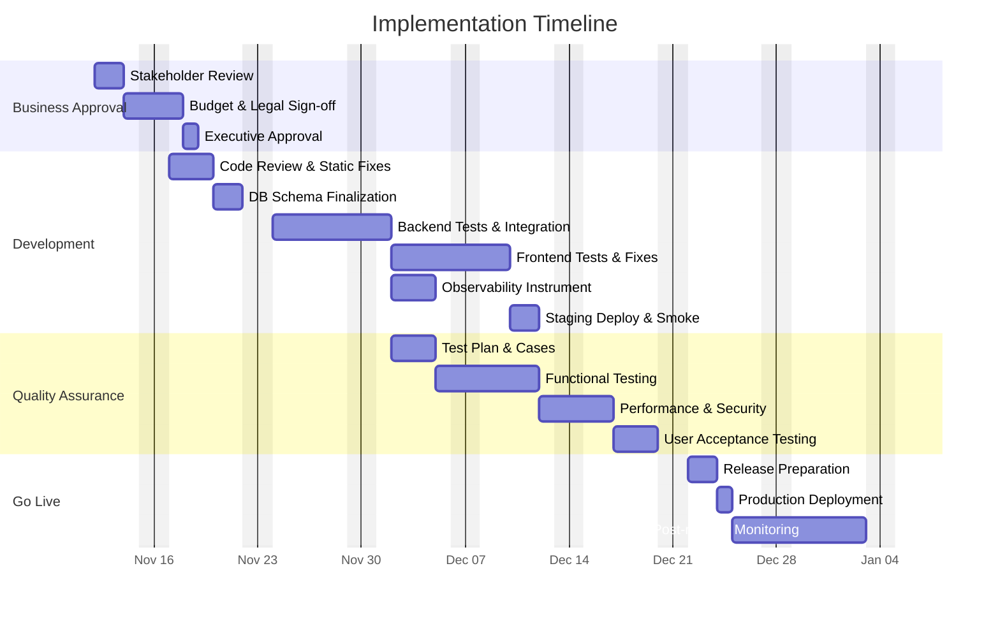

# Product Decision Records (PDRs

Each PDR records a product decision. It is composed of the following sections and should give engineers a clear, actionable understanding of what needs to be built.


## Standard PDR Structure

- Status: Proposed

 - Date: 2025-11-11

 - Owners:
    - Gabriel Storti — Product Manager — gabriel.storti@example.com
    - Gabriel Davi Lopes Jacobini — DevOps Engineer — gabriel.davi@example.com
    - Luis Chiqueto — Frontend Engineer — luis.chiqueto@example.com
    - Backend Lead — backend.lead@example.com (TBD)
    - QA Lead — qa.lead@example.com (TBD)

 - Links:
    - Issue / Ticket (planning): https://github.com/memento-marcio-org/Planeja-AI/issues/42
    - PR (implementation tracking, when created): https://github.com/memento-marcio-org/Planeja-AI/pull/42
    - Repo (root): https://github.com/memento-marcio-org/Planeja-AI
    - Backend README: `backend/README.md`
    - DB Schema: `backend/database/schema.sql`
    - Key controllers: `backend/src/controllers/taskController.ts`, `backend/src/controllers/listController.ts`
    - Frontend main page and components: `frontend/planeja-ai/app/page.tsx`, `frontend/planeja-ai/components/add-task-form.tsx`, `frontend/planeja-ai/components/task-list.tsx`
    - Dashboard (tasks KPIs - placeholder): https://grafana.example.com/d/planeja/tasks-dashboard

- Context: Background, problem, constraints, decision drivers, evidence (link to metrics)

- Decision: The choice made, specific and testable

- Alternatives Considered: Options with pros/cons

- Consequences: Positive/negative impacts, risks, rollback plan

- Implementation Plan: High-level steps

- Testing and Verification: How we validate and monitor

- Traceability: RFs and RNFs affected; matrix link

- Effort Estimate: Ranges/assumptions by role


## Decision (Path Foward)

This PDR documents the product decision to maintain and standardize the existing To-Do Item feature set in Planeja-AI (tasks CRUD, list management, AI suggestion integration) and to formalize a forward implementation/maintenance plan that is specific, testable and actionable for engineering. The objective is to ensure the API, database schema, and frontend behavior are aligned, documented, and have clear acceptance criteria and tests.

We will treat the current implementation (as present in the codebase) as the baseline and produce a consolidated, testable plan to stabilize, extend (where low-risk), and monitor it. This includes:

- Standardizing the task API (endpoints described in `backend/src/routes/tasks.ts` and implemented in `backend/src/controllers/taskController.ts`).
- Confirming and documenting DB fields used by the frontend (`to_do_item` table: `id`, `list_id`, `item_order`, `name`, `description`, `done`, and inferred fields such as `priority`, `due_date`, `created_at`, `updated_at`).
- Capturing frontend flow (task fetch, add, update, toggle complete, AI-suggest) from `frontend/planeja-ai/app/page.tsx` and related components.

Justification:

We will maintain and formalize the existing behavior — the product currently supports creating tasks, listing, marking complete, editing, deleting, and an AI suggestion flow. The codebase already implements the REST endpoints and UI flows; this PDR aims to document the decision to treat that implementation as production-capable baseline, provide acceptance criteria, list alternatives for improvements (e.g., server-side scheduling/recurring tasks), and prescribe tests, monitoring and rollout.

Example justification text:

```text
We will standardize and stabilize the existing To-Do feature because the current repository already provides a full end-to-end flow (Supabase-backed items with frontend CRUD and AI suggestion). Formalizing this allows engineering to test, harden, and measure success without large rework. This is lower risk and provides immediate value to users while enabling iterative enhancements.
```


## Why (Evidence and Support)

- Code evidence: The backend exposes endpoints for tasks and lists in `backend/src/routes/tasks.ts` and `backend/src/routes/lists.ts`. `taskController.ts` contains endpoints: `GET /tasks`, `GET /tasks/pending`, `GET /tasks/completed`, `POST /lists/:listId/items` (create task), `PUT /tasks/:id/complete`, `DELETE /tasks/:id`.

- Database evidence: `backend/database/schema.sql` defines `to_do_item`, `to_do_list`, `to_do_plan` and `steps`. The `to_do_item` table contains core fields used by frontend logic and includes indices for `done`, `priority`, `due_date` (some fields are present or referenced in indices, showing intended product behavior for filtering).

- Frontend evidence: `frontend/planeja-ai/app/page.tsx` uses Supabase client to fetch and manipulate `to_do_item`. Components `AddTaskForm` and `TaskList` implement the UI flows for adding, editing, toggling completion and AI-suggested tasks.

- User value: The app UI centers on personal task lists and analytics cards (completed/pending counts); documenting and stabilizing this flow preserves immediate value and reduces regression risk.

- Decision drivers: Low-risk stabilization, faster time-to-value, consistency between frontend/back-end schema, and enabling observability and testability.


## When (Support)

Decision timing: 2025-11-11 — chosen because the workspace demonstrates a complete baseline implementation; stabilizing now captures value immediately and avoids diverging implementations. This will be the first iteration: document baseline and add tests/monitoring. Further feature work (recurring tasks, scheduling, advanced AI flows) will be planned after baseline acceptance.


## How

Implementation steps (high-level) and checklist. Engineers should follow these steps to stabilize and formalize the current To-Do implementation.

1. Code review and static verification
   - [ ] Review `backend/src/controllers/taskController.ts` for edge-case handling and consistent error messages.
   - [ ] Review `backend/src/controllers/listController.ts` for list ownership validation.
   - [ ] Confirm route definitions in `backend/src/routes/tasks.ts` and `backend/src/routes/lists.ts` match controllers.

2. Database schema verification
   - [ ] Confirm `backend/database/schema.sql` matches production schema in Supabase (fields: `id`, `list_id`, `item_order`, `name`, `description`, `done`, `priority?`, `due_date?`, `created_at`, `updated_at`).
   - [ ] Add any missing migrations or SQL scripts to explicitly document `priority`, `due_date`, and timestamps if they are intended but not present.

3. API contract and tests
   - [ ] Define an OpenAPI/Swagger snippet for the tasks endpoints (GET /tasks, POST /lists/:listId/items, PUT /tasks/:id/complete, DELETE /tasks/:id).
   - [ ] Implement unit tests for `TaskController` methods (happy path + 2-3 edge cases each).
   - [ ] Add integration tests hitting the API endpoints against a local test Supabase instance or mocks.

4. Frontend validation
   - [ ] Confirm `frontend/planeja-ai/app/page.tsx` handles server errors gracefully (currently logs to console; add user-friendly error UI where appropriate).
   - [ ] Add component-level tests for `AddTaskForm` and `TaskList` (use Jest/React Testing Library).
   - [ ] Verify the AI suggestion flow (`/api/suggest-task`) exists and has error handling (if missing, document as a follow-up).

5. Observability and monitoring
   - [ ] Add Sentry or server logging hooks for task creation failures and other 5xx errors.
   - [ ] Add metrics (Prometheus/Grafana or Supabase logs) for: tasks created per day, tasks completed per day, error rates, API latency.

6. Rollout
   - [ ] Release behind a feature flag (if available) or ensure low-risk deployment (DB read/write compatible).
   - [ ] Run smoke tests in staging: create task, mark complete, edit, delete.

Checklist for engineers (detailed):

- [ ] Run `backend/README.md` setup steps and confirm local API runs.
- [ ] Run schema `backend/database/schema.sql` against a test Supabase instance and confirm tables and indices.
- [ ] Add automated tests for controllers and components.
- [ ] Add API contract (OpenAPI) and add to repo under `docs/`.
- [ ] Add monitoring instrumentation and dashboards.
- [ ] Deploy to staging, run smoke tests, then schedule production deploy.


## Test Cases

Core test cases engineers must implement and verify. Each test case should be automated where possible.

API tests (unit + integration):

- [ ] Verify GET /tasks returns items for authenticated user and respects `done` and `list_id` filters.
- [ ] Verify GET /tasks/pending returns only tasks with `done = false` for authenticated user.
- [ ] Verify GET /tasks/completed returns only tasks with `done = true` for authenticated user.
- [ ] Verify POST /lists/:listId/items creates a new task when the list belongs to the user (assert next `item_order`).
- [ ] Verify POST /lists/:listId/items returns 404 when list doesn't belong to user.
- [ ] Verify PUT /tasks/:id/complete marks task as done only when the task belongs to the user and returns updated item.
- [ ] Verify DELETE /tasks/:id deletes task only when the task belongs to the user.
- [ ] Verify error handling: unauthenticated requests return 401; server errors return 500 with consistent message schema.

Frontend tests (component + integration):

- [ ] AddTaskForm: should call `onAddTask` with non-empty title and clear the input.
- [ ] AddTaskForm: clicking AI Suggest triggers `onAISuggest` callback.
- [ ] TaskList: toggling checkbox calls `onToggleComplete` with correct id and value.
- [ ] TaskList: editing task updates UI and calls `onUpdateTask` on save.
- [ ] Page flow: adding a task updates the UI list and analytics counts; toggling complete updates counts.

Manual/UAT:

- [ ] Staging smoke: create, edit, complete, delete a task with a test user.
- [ ] UAT with small user group for AI suggestions (if AI feature is behind a flag).

Monitoring checks after deploy:

- [ ] Errors: Sentry rate < 0.1% of requests for task endpoints.
- [ ] Latency: p95 API latency for task endpoints < 500ms.
- [ ] Business metrics: tasks created per week and tasks completed per week (monitor for regressions).


## Traceability matrix (US - Product Motive)

| User Story ID | User Story Description | Product Motive ID | Product Motive Description |
|---------------|------------------------|-------------------|----------------------------|
| US-101 | As a user, I want to add a task so I can track my work | PM-01 | Allow users to capture tasks quickly and reliably |
| US-102 | As a user, I want to view tasks filtered by state (all/pending/completed) | PM-02 | Improve task visibility and management |
| US-103 | As a user, I want to mark tasks as completed so I can see progress | PM-03 | Improve task completion tracking and motivation |
| US-104 | As a user, I want to edit task details (name/description) | PM-04 | Provide flexibility to correct or add details |
| US-105 | As a user, I want AI suggestions for tasks to speed up task capture | PM-05 | Increase user productivity and engagement |


## How Much

This Section must detail the Timeline of the execution for each task. The below timeline is a recommended plan for a small team (1-2 backend, 1 frontend, 1 QA) and is conservative to allow review and testing.




---

Notes & assumptions made while generating this record (explicit):

- The PDR is produced without additional stakeholder interviews as requested; all facts are inferred from the repository code and READMEs.
- Owners and specific dates (approvals) are placeholders and should be replaced with the actual people/dates when available.
- Database fields (`priority`, `due_date`) were referenced in indices in `schema.sql` and are assumed intended fields — confirm actual production schema before migrating.
- AI suggestion endpoint `/api/suggest-task` is referenced in frontend code; its implementation should be verified (the PDR treats AI-suggest as an existing feature to be validated).

Verification summary (how this PDR was created):

- Inspected backend routes and controllers: `backend/src/routes/tasks.ts`, `backend/src/controllers/taskController.ts`, `backend/src/controllers/listController.ts`.
- Inspected frontend main page and components: `frontend/planeja-ai/app/page.tsx`, `frontend/planeja-ai/components/add-task-form.tsx`, `frontend/planeja-ai/components/task-list.tsx`.
- Reviewed DB schema in: `backend/database/schema.sql`.

If you want additional PDR files (for example: separate PDRs for "AI Suggestions", "Recurring Tasks", or "Background Scheduling") I can create them now using the same approach and save them to `#PDRs/`.
