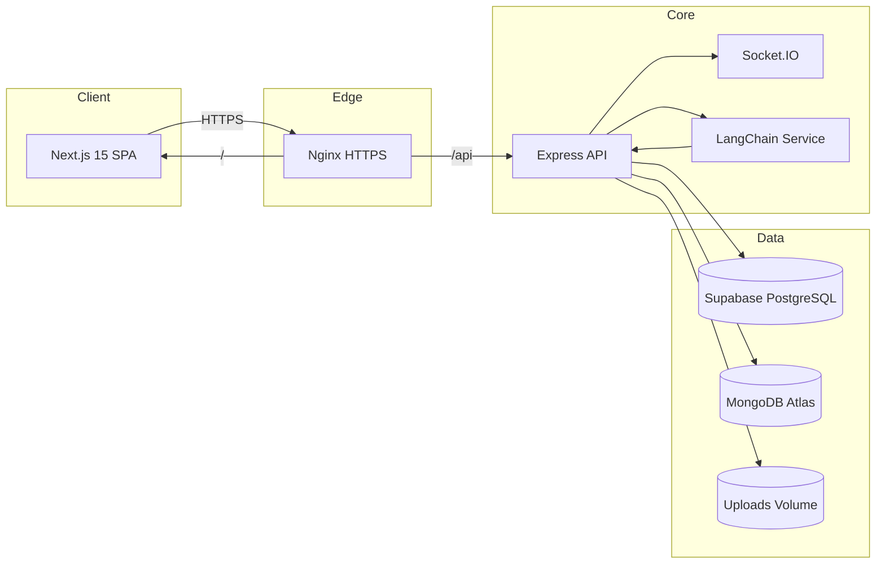
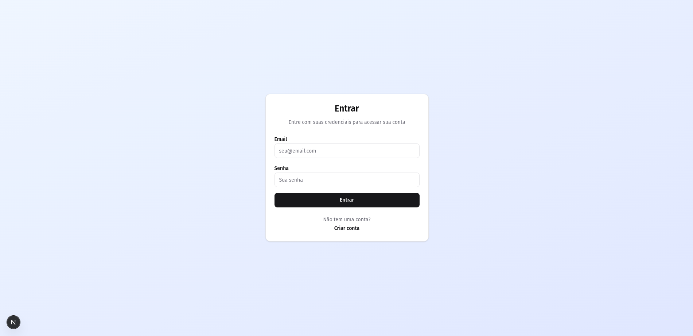
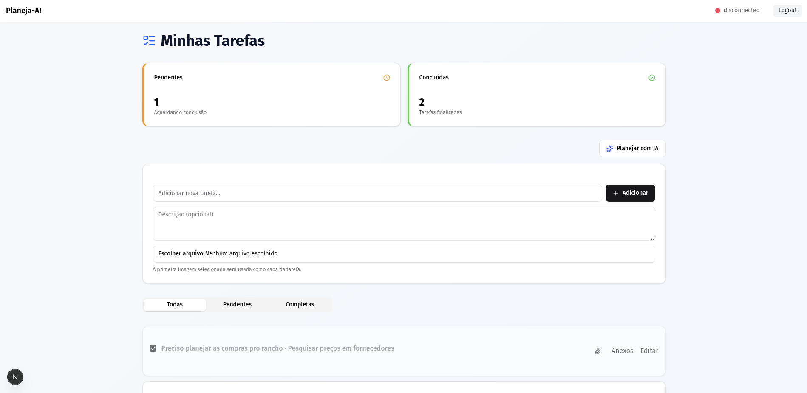
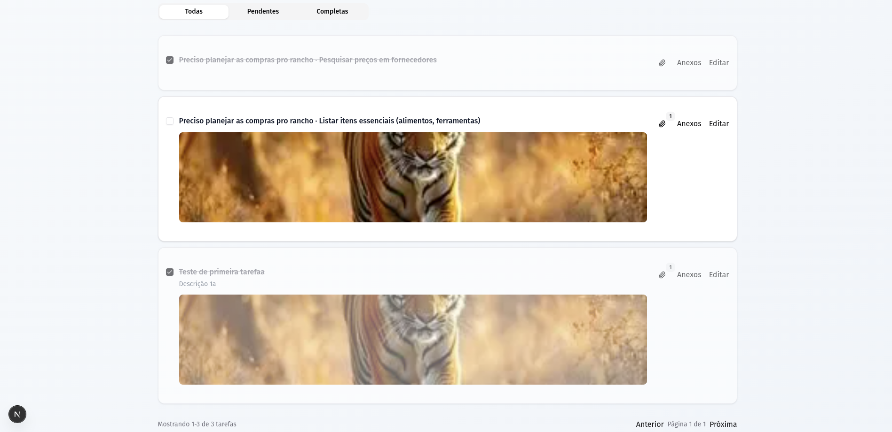
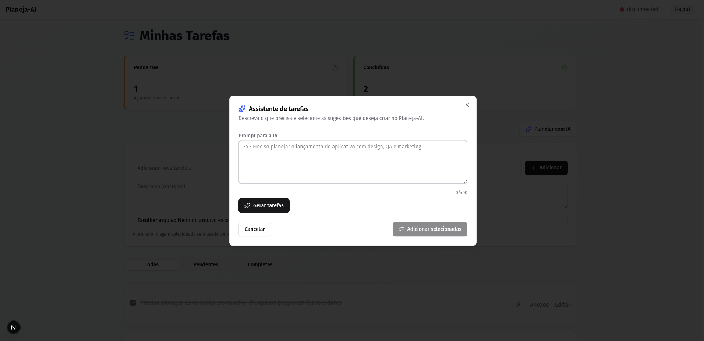
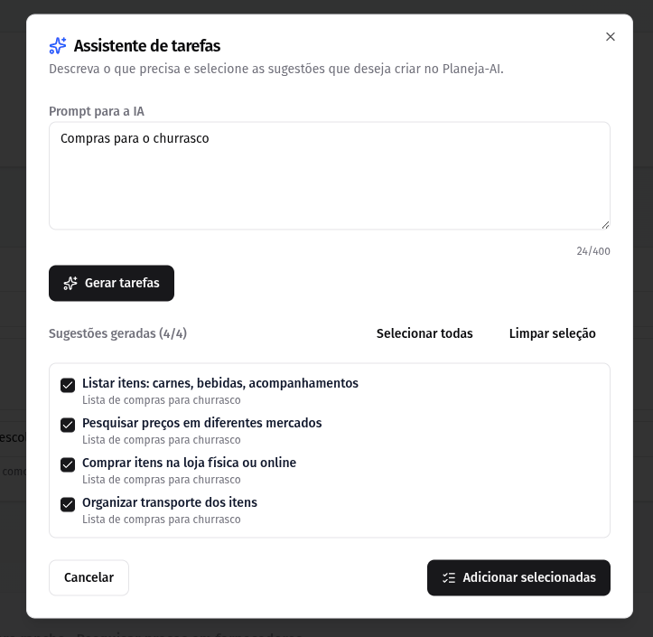
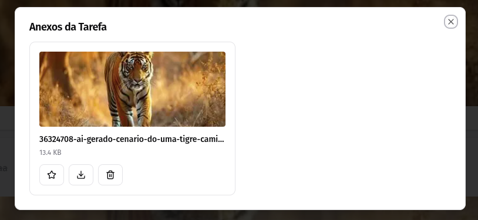

# Planeja-AI

Sistema full-stack de planejamento inteligente que combina listas de tarefas, anexos ricos e sugestões via IA para apoiar o usuário do planejamento ao acompanhamento das atividades.

---

## 🏗️ Arquitetura (alto nível)



---

## 🎥 Demonstração

[Vídeo de demonstração funcional do sistema](https://youtu.be/yfAoe_wbHqg)

---

## 📸 Prints do Sistema

Visão geral das principais telas e fluxos em execução:

| Dashboard com métricas e sugestões IA | Modal de sugestões IA |
| --- | --- |
|  |  |

| Lista de tarefas com anexos | Chat com IA |
| --- | --- |
|  |  |

| Autenticação e tokens ativos | Upload/visualização de anexos |
| --- | --- |
|  |  |

---

## ⚙️ Funcionalidades Principais

- **Autenticação segura** com registro, login e renovação de tokens JWT + refresh token em cookie HTTP only.
- **Gestão de listas e tarefas** com CRUD completo, filtros (todas, pendentes, concluídas) e paginação.
- **Anotações enriquecidas**: descrição extensa, sugestão automática de tarefas via IA (LangChain + OpenAI) e estado concluído.
- **Anexos e capa visual**: upload de múltiplas imagens/documentos, geração de thumbnails, definição de capa e pré-visualização inline.
- **Chat assistivo** com histórico, web-socket streaming e IA para dúvidas rápidas sobre o planejamento.
- **Alertas e feedbacks** centralizados com toasts Sonner para toda ação crítica (login, anexos, tarefas, chat).
- **Observabilidade básica**: health check (`/health`), logs estruturados e limpeza automática de refresh tokens expirados.

---

## ✅ Requisitos Técnicos Atendidos

| Requisito | Implementação |
| --- | --- |
| **Frontend moderno** | Next.js 15 + React 19 + Tailwind/Radix/Shadcn, responsivo e otimizado para mobile. |
| **Backend API REST** | Express + TypeScript, controllers organizados, validação (express-validator) e rotas `/api/v1`. |
| **Banco de dados SQL + NoSQL** | Supabase/PostgreSQL armazena usuários/listas/tarefas; MongoDB Atlas guarda metadados de anexos. |
| **Criptografia de senha** | `bcryptjs` com salt para hash antes do armazenamento. |
| **Autenticação e rotas protegidas** | JWT + refresh token em cookie, middleware `authenticateToken` e proteção em toda rota `/api/v1`. |
| **Containerização com Docker** | Dockerfiles multistage para frontend/back, `docker-compose.yml` com Nginx reverse proxy + SSL. |
| **Uso de IA** | Serviços em `backend/src/services/chatService.ts` e rotas de chat usam LangChain + OpenAI para geração de respostas e sugestões automáticas. |
| **Documentação + diagrama** | README com instruções de instalação/uso e diagrama de arquitetura (ver seção abaixo). |

---

## 👥 Equipe de Desenvolvimento

| Nome               | Responsabilidade |
| ------------------ | ---------------- |
| **Thales**         | Backend          | 24740
| **Gabriel Storti** | Frontend         | 
| **Luis Felipe**    | Frontend         | 24661
| **João Pedro**     | Banco de dados   | 24823
| **José Eduardo**   | Documentação     | 
| **Gabriel Davi**   | DevOps           |
| **Diego**          | Documentação     | 24753
| **Maria Fernanda** | UI/UX            | 24767
| **Leticia Silva**  | NoSQL (MongoDB)  | 21352

---

## 📦 Estrutura do Projeto

```
Planeja-AI/
├── backend/              # Express + TS + Vitest + Dockerfile
├── frontend/planeja-ai/  # Next.js 15 + App Router + Dockerfile
├── infra/                # Nginx reverse proxy + certificados TLS
├── database/             # Schemas e scripts SQL
├── docker-compose.yml    # Orquestração em produção
└── docker-compose.local.yml # Stack de desenvolvimento (Postgres, Redis, MinIO opcional)
```

---

## 🔧 Como Executar o Projeto

### 1. Pré-requisitos

- Node.js 20+ e npm 10+
- Docker + Docker Compose
- Contas no Supabase (Postgres) e MongoDB Atlas
- Chave de API da OpenAI (ou provider compatível)

### 2. Variáveis de ambiente mínimas

`backend/.env`
```env
PORT=3001
NODE_ENV=development
SUPABASE_URL=https://seu-projeto.supabase.co
SUPABASE_ANON_KEY=...
SUPABASE_SERVICE_ROLE_KEY=...
MONGODB_URI=mongodb+srv://...
JWT_SECRET=troque-me
SESSION_SECRET=troque-me
OPENAI_API_KEY=sk-...
FRONTEND_URL=http://localhost:3000
REDIS_HOST=redis
REDIS_PORT=6379
```

`frontend/planeja-ai/.env`
```env
NEXT_PUBLIC_API_URL=http://localhost:3001/api/v1
NEXT_PUBLIC_SOCKET_URL=http://localhost:3001
NEXT_PUBLIC_SUPABASE_URL=https://seu-projeto.supabase.co
NEXT_PUBLIC_SUPABASE_ANON_KEY=...
```

### 3. Execução para desenvolvimento

```bash
git clone https://github.com/memento-marcio-org/Planeja-AI.git
cd Planeja-AI

# backend
cd backend
npm install
npm run dev

# frontend (novo terminal)
cd ../frontend/planeja-ai
npm install
npm run dev
```

Backend exposto em `http://localhost:3001` e frontend em `http://localhost:3000`.

### 4. Execução com Docker (produção)

1. Gere certificados de desenvolvimento (ou traga os oficiais):
   ```bash
   bash infra/certificates/generate-certs.sh
   ```
2. Construa e suba os serviços:
   ```bash
   docker compose up --build -d
   ```
3. Acesse `https://localhost` (Nginx direciona para frontend/backend).

### 5. Scripts úteis

- `backend`: `npm run test`, `npm run lint`, `npm run migrate`
- `frontend`: `npm run lint`, `npm run build`, `npm run start`

---

## 📚 Endpoints Principais

- **Autenticação**: `POST /api/v1/auth/register`, `POST /api/v1/auth/login`, `POST /api/v1/auth/refresh`, `POST /api/v1/auth/logout`, `GET /api/v1/auth/me`
- **Listas/Tarefas**: `GET /api/v1/lists`, `POST /api/v1/lists`, `POST /api/v1/lists/:listId/items`, `GET /api/v1/tasks`, `PUT /api/v1/tasks/:id/complete`
- **Anexos**: `POST /api/v1/tasks/:taskId/attachments`, `GET /api/v1/tasks/:taskId/attachments`, `PUT /api/v1/tasks/:taskId/attachments/:attachmentId/set-cover`
- **Chat/IA**: `GET /api/v1/chats`, `POST /api/v1/chats/messages` (stream via Socket.IO)

Todos os endpoints (exceto autenticação) exigem bearer token ou cookie de sessão válido.

---

## 📄 Licença

Projeto acadêmico para a disciplina **Desenvolvimento Web 2** – uso educacional.

---

## 🔗 Links Úteis

- [Vídeo de demonstração funcional do sistema](https://youtu.be/yfAoe_wbHqg)
- [Next.js Docs](https://nextjs.org/docs)
- [Supabase Docs](https://supabase.com/docs)
- [Express.js](https://expressjs.com/)
- [LangChain Docs](https://js.langchain.com/docs/)
